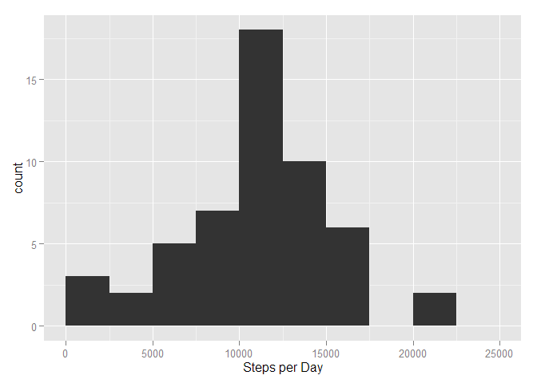
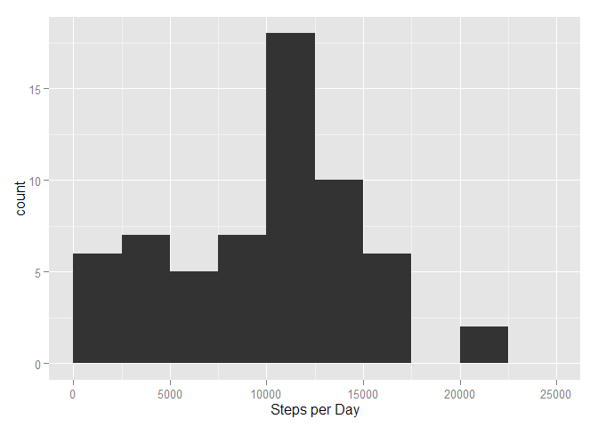
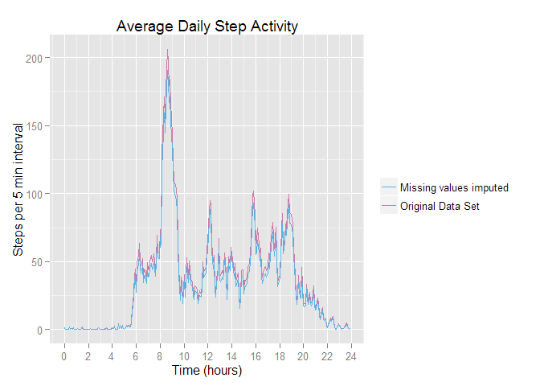

# Reproducible Research: Peer Assessment 1


## Loading and preprocessing the data

First, we will check for needed data files in the working directory. Then download and unzip as needed.

```r
if(!file.exists("activity.csv")){
    if(!file.exists("activity.zip")) {
        download.file("https://d396qusza40orc.cloudfront.net/repdata%2Fdata%2Factivity.zip",
                      destfile = "activity.zip")
    }
    unzip("activity.zip")
}
```

Next, we will read in the data.

```r
activity <- read.csv("activity.csv", colClasses = c("integer", "Date", "integer"))
str(activity)
```

```
## 'data.frame':	17568 obs. of  3 variables:
##  $ steps   : int  NA NA NA NA NA NA NA NA NA NA ...
##  $ date    : Date, format: "2012-10-01" "2012-10-01" ...
##  $ interval: int  0 5 10 15 20 25 30 35 40 45 ...
```
This data set includes 17,568 observations on three variables:  

- steps: Number of steps taking in a 5-minute interval (missing values are coded as NA)
- date: The date on which the measurement was taken in YYYY-MM-DD format
- interval: Identifier for the 5-minute interval in which measurement was taken


## What is mean total number of steps taken per day?

First, we create a contingency table to sum steps taken for each distinct date.

```r
library(ggplot2)
daily <- with(activity, xtabs(steps ~ date))
quantile(daily)
```

```
##    0%   25%   50%   75%  100% 
##    41  8841 10765 13294 21194
```

```r
qplot(steps.Freq, data=data.frame(steps = daily), geom="histogram", binwidth = 2500, xlim = c(0,25000), xlab = "Steps per Day")
```




```r
daily_mean <- format(mean(daily))
daily_median <- median(daily)
```
We can see that the daily mean and median steps are **10766.19** and **10765** respectively.


## What is the average daily activity pattern?

We want to explore the average number of steps that are measured for each 5 minute time interval across all days.  This will allow us to see the typical activity over the period of an average day.

First we want to generate the average number of steps for each 5 minute interval.

```r
time_interval <- with(activity, xtabs(steps ~ interval)) / length(daily)
intervalDF <- data.frame(time_interval)
colnames(intervalDF)[2] = "Steps"
intervalDF$interval <- as.integer(levels(intervalDF$interval))[intervalDF$interval]
intervalDF$hour <- (intervalDF$interval %/% 100) + (as.numeric(intervalDF$interval) %% 100)/60
```
We can count the total number of steps at each 5 minute interval, then divide by the total number of days with valid observations.  This gives us the average number of steps per day at each interval.  We convert the intervals into a new column to get the time in hours.

Results:

```r
g <- qplot(hour, Steps, data=intervalDF, geom="line", ylab="Steps per 5 minutes", 
           xlab="Time (hours)", xlim(c(0,24)), colour=Steps, main="Average Daily Activity Pattern")
g + scale_colour_gradient(low="red", high="green") + scale_x_continuous(breaks=(0:12)*2)
```


We can see that activity peaks in the morning hours between 8am and 10am.  Then again around noon, 4pm and 6pm.


```r
max_loc <- which.max(intervalDF$Steps)
max_steps <- format(intervalDF$Steps[max_loc])
max_interval <- format(intervalDF$interval[max_loc])
max_steps_time <- format(intervalDF$hour[max_loc])
```
We see that the average maximum steps is **206.1698** at **8.583333** hours (interval: 835).


## Imputing missing values
We have a good idea for the number of steps we see on average and how those steps are distributed over an average day.  But our data set also has a lot of missing observations.


```r
length(activity$steps[is.na(activity$steps)==TRUE])
```

```
## [1] 2304
```

This is a significant number of missing observations that may be skewing our data.  
To help our data better represent the actual steps of our subject, we want to infer possible values for the missing data. Before we infer this data, we'll start with the following assumptions:

- Step measurements are expected to be similar at the same time interval on different days.  Many people have a routine that repeats on a daily cycle e.g. meals, sleep, travel.
- The time series of steps throughout a day are expected to be similar to other days that are the same weekday. Work, school and other hobby schedules tend to have a weekly cycle. 

To fill in this missing data we can adopt a strategy of modeling the distribution of steps at each time interval across a particular day of the week (M-Su).  Then obtain a random measurement that aligns with the distribution at that interval for that day of the week.

First, let's add day name information to our data set.


```r
activity$WeekDay <- weekdays(activity$date)
```

Next, we'll write a function that takes the step observation, interval and a weekday and returns a random value using the mean and standard deviation for that subset.


```r
get_rnorm <- function(stepobs, intervl, day){
    #Checks if stepobs is NA. If NA, returns random number based on normal distribution generated from intervl and day
    set.seed(1000)
    if(is.na(stepobs)){
        sample <- activity$steps[activity$interval==intervl & activity$WeekDay==day]
        result <- as.integer(rnorm(1, mean = mean(sample, na.rm = T), sd = sd(sample, na.rm=T)))
        if(result >= 0){
            return(result)
        } else {
            return(0)
        }
    } else {
        return(stepobs)
    }
}
```
Now, we will iterate through our data set replacing all NA values with the output from get_rnorm


```r
newsteps <- mapply(get_rnorm, activity$steps, activity$interval, activity$WeekDay)
activity2 <- data.frame(activity)
activity2$steps <- newsteps
length(activity2$steps[is.na(activity2$steps)==TRUE])
```

```
## [1] 0
```

We can see we have now removed all NAs from our data set. Let's take another look at the histogram to see how it has changed now that we have removed our missing values.


```r
daily2 <- with(activity2, xtabs(steps ~ date))

qplot(steps.Freq, data=data.frame(steps = daily2), geom="histogram", binwidth = 2500, 
      xlim = c(0,25000), xlab = "Steps per Day")
```



We can see the distribution has filled out a bit more on the left side.  This may indicate that more of our missing values were on days and time intervals with a low frequency of steps.

Let's see how the median and mean have changed from our previous data set.  Based on the histogram, we would expect the mean and median to decrease.

```r
daily2_mean <- format(mean(daily2))
daily2_median <- format(median(daily2))
```
The previous mean of 10766.19 has decreased to **9753.459**.  The previous median, 10765 has decreased to **10395**.

Let's take a look at the average daily activity pattern with our updated dataset:

```r
time_interval2 <- with(activity2, xtabs(steps ~ interval)) / length(daily2)
intervalDF$Steps2 <- as.numeric(time_interval2)
g2 <- ggplot(intervalDF) + geom_line(aes(x=hour,y=Steps, colour="Original Data Set", scale_name="")) +
        geom_line(aes(x=hour,y=Steps2, colour="Missing values imputed")) + scale_x_continuous(breaks=(0:12)*2) + 
        scale_colour_manual("", breaks = c("Missing values imputed", "Original Data Set"), values = c("#56B4E9","#CC79A7")) +
        labs(title="Average Daily Step Activity")
update_labels(g2, list(x = "Time (hours)", y = "Steps per 5 min interval"))
```


We can see that our method for imputing the missing values has not drastically changed the time series other than lowering the average number of steps at various intervals.

The downside to this method is when missing values tend to appear at the same times on the same weekdays.  In that situation, we are most likely setting the number of steps to 0.  However, the time series does seem to follow with what we would expect for an average daily schedule.

## Are there differences in activity patterns between weekdays and weekends?
We expect that weekday and weekend days will differ in activity based on the assumption that our subject follows a typical work week schedule.

First lets add a factor to our data set to label weekends and weekdays:


```r
daylookup <- function(day){
    if(day == "Saturday" | day == "Sunday"){
        return("weekend")
    } else {
        return("weekday")
    }
}

activity2$DayType <- sapply(activity2$WeekDay, daylookup)
activity2$hour <- (activity2$interval %/% 100) + (as.numeric(activity2$interval) %% 100)/60
```


Now we can plot the time series for weekdays and weekends to observe if there is any difference in average activity as we would expect.


```r
g3 <- ggplot(activity2, aes(x = hour, y = steps, colour=DayType)) + stat_summary(fun.y=mean, geom="line") +
    facet_grid(DayType ~ .) + labs(title="Average Daily Step Activity") + scale_x_continuous(breaks=(0:12)*2)
update_labels(g3, list(x = "Time (hours)", y = "Steps per 5 min interval"))
```


The weekday plot shows that the steps tend to spike at certain periods of the day with lower minimums.  For weekends, We can see lower peaks and minimums are a bit higher. Weekend activity shows steps starting a bit later in the day and continuing into the later evening hours.
